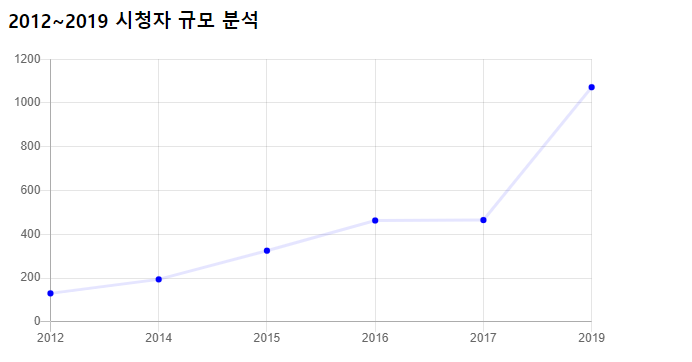
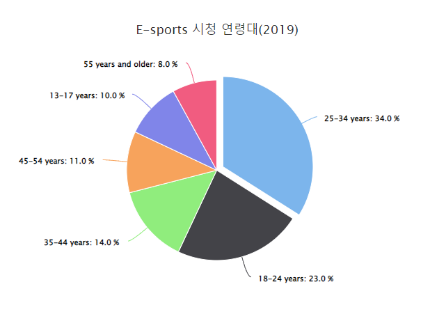
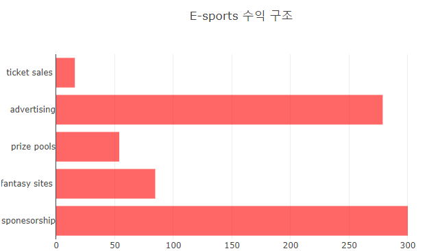

# 자바 스크립트 차트

### 사용한 Chart 사이트
>[highchart](https://www.highcharts.com/)   
>[chart.js](https://www.w3schools.com/js/js_graphics_chartjs.asp)   
>[plotly](https://www.w3schools.com/js/js_graphics_plotly.asp)

 * chart.js 를 이용한   e-sports 시청자 규모 분석 (년도별)*
 </img>
 <canvas id="myChart" style="width:100%;max-width:600px"></canvas>
      
      var xValues = [2012, 2014, 2015, 2016, 2017, 2019];
        var yValues = [130, 194 ,325 , 463, 465, 1072];
        new Chart("myChart", {
          type: "line",
          data: {
            labels: xValues,
            datasets: [{
              fill: false,
              lineTension: 0,
              backgroundColor: "rgba(0,0,255,1.0)",
              borderColor: "rgba(0,0,255,0.1)",
              data: yValues
            }]
          },
          options: {
            legend: {display: false},
            scales: {
              yAxes: [{ticks: {min: 0, max:1200}}],
            }
          }
        }); 

 * highchart를 이용한 시청 연령대*  
 </img>
  <figure class="highcharts-figure">
            

            

              
          </figure>
          

          
       Highcharts.chart('container', {
  chart: {
    plotBackgroundColor: null,
    plotBorderWidth: null,
    plotShadow: false,
    type: 'pie'
  },
  title: {
    text: 'E-sports 시청 연령대(2019)'
  },
  tooltip: {
    pointFormat: '{series.name}: <b>{point.percentage:.1f}%</b>'
  },
  accessibility: {
    point: {
      valueSuffix: '%'
    }
  },
  plotOptions: {
    pie: {
      allowPointSelect: true,
      cursor: 'pointer',
      dataLabels: {
        enabled: true,
        format: '<b>{point.name}</b>: {point.percentage:.1f} %'
      }
    }
  },
  series: [{
    name: 'AGE',
    colorByPoint: true,
    data: [{
      name: '25-34 years',
      y: 34,
      sliced: true,
      selected: true
    }, {
      name: '18-24 years',
      y: 23
    },  {
      name: '35-44 years',
      y: 14
    }, {
      name: '45-54 years',
      y: 11
    }, {
      name: '13-17 years',
      y: 10
    },  {
      name: '55 years and older',
      y: 8
    }]
  }]
}); 
 
 * plotly 를 이용한 수익구조*   
</img>

     
      

### 호스팅 주소
> [github.io](https://kimcm1.github.io/Game_pgm/1109)   

